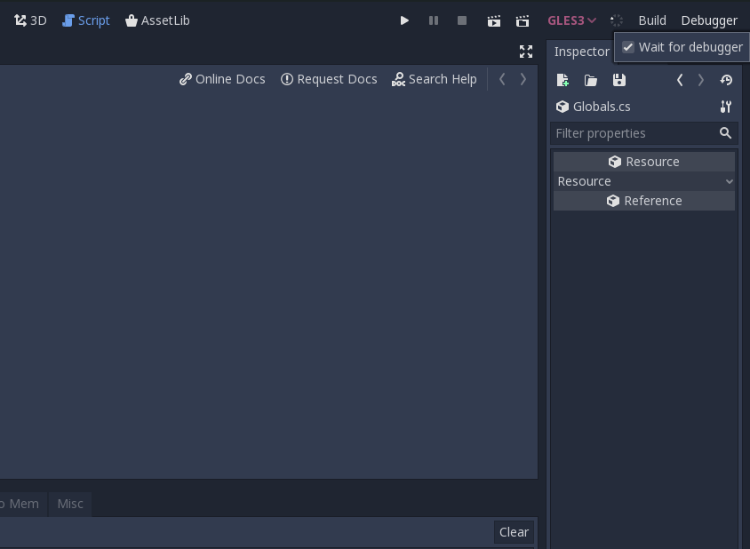

# Summary

If you enable debugging with Godot/C#, you have to run the debugger through the IDE every single time you launch Godot. If not, Godot will quickly fail. Going to the project settings and disabling the debugger is also tedious.

That's where this plugin comes in: it adds a small, simple toggle for running Godot with or without debugging:

# Installation

1. Create an `addons` folder inside your project
2. Git clone this repo inside the addons folder
3. Go to `Project Settings` -> Addons and enable this plugin.
4. You will see a `Debugger` menu on the very right of your UI next to the `Build` menu.